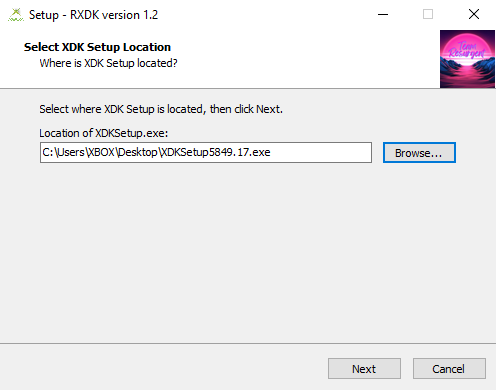
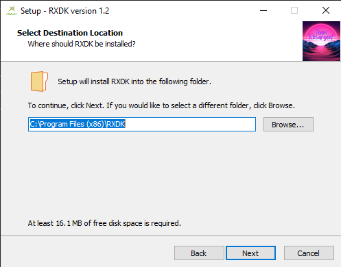
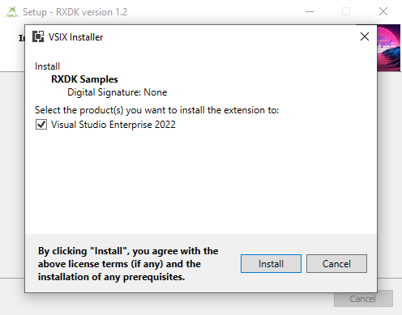
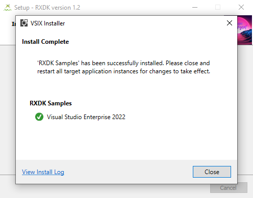

---

# RXDK: Modern Development for the Original Xbox

**RXDK**: is a community-driven project that enables developers to build software for the Original Xbox using modern Windows operating systems like Windows 10 and 11, as well as newer versions of Visual Studio starting from 2019. Traditionally, developing for the Original Xbox required a Windows XP environment (often via a virtual machine), Visual Studio 2003 .NET, and the official Xbox Development Kit (XDK) installer. RXDK eliminates these limitations by providing an open-source installer that integrates the XDK with modern development environments.

---

## 🚀 Features

- **Modern Development Environment**: Compile Xbox applications using Visual Studio 2019 and beyond.
- **Simplified Installation**: Automates the setup process for the XDK on modern Windows platforms.
- **Open Source**: Developed collaboratively by the Xbox-scene community.
- **Enhanced Compatibility**: Eliminates the need for legacy systems like Windows XP and Visual Studio 2003 .NET.
- **Existing Tools Support**: Adds Support and work arounds for debugging tools such as Xbox Watson Etc
---

## 🚧 Limitations and Disclaimer

Please note the following limitations and important information:

- **Debugging Not Yet Supported**: Features such as adding breakpoints and debugging through Visual Studio are not currently functional.
- **No Deployment via Visual Studio**: File transfer to the Xbox cannot be done using the Visual Studio deploy option. Instead, you will need to manually transfer files to your Xbox or use an emulator such as **Xemu** for testing.
- **XDKSetup5849.17 Recommended**: The **official XDKSetup** is not included with this tool. Users must provide their own copy of the installer. Other versions of XDKSetup may work but have not been thoroughly tested. This example was tested specifically with version 5849.17.
- **Disclaimer**: We cannot and will not be held liable for where or how you obtain the XDKSetup installer. Additionally, we will not provide further instructions on obtaining it.
- **Early Development Stage**: RXDK is in its early stages and may contain bugs or missing features. Community contributions are encouraged to enhance its functionality and stability.

---

## 📥 Installation

Follow these steps to install and set up RXDK:

1. Clone or download the RXDK repository or installer from Releases Page.
2. Run the RXDK installer.
3. Follow the on-screen instructions to configure the XDK (5933) with your Visual Studio installation.

> **Note**: Ensure you have Visual Studio 2019 (or later) installed prior to running the RXDK installer.

---

## 🛠 Usage

Once installed, you can compile and build Original Xbox applications directly in Visual Studio. Simply:

1. Create or open an Xbox project.
2. Use the provided templates or make your own custom configurations.
3. Build your project.
4. Transfer the compiled files to your Xbox or emulator (e.g., Xemu) for testing.

---

## 🧰 Technologies Used

- **Microsoft Visual Studio**: 2019 and newer versions.
- **Xbox Development Kit (XDK)**: Official XDK installer.
- **Windows OS**: Modern versions, such as Windows 10/11.

---

## 🌟 Contributing

We welcome contributions from the community! If you'd like to contribute to RXDK, follow these steps:

1. Fork the repository.
2. Create a new branch for your feature or bug fix.
3. Submit a pull request with a detailed description of your changes.

For larger contributions, please open an issue to discuss your ideas with the maintainers.

---

## 📸 Screenshots

---

## 📜 License

---

## 📞 Contact

For questions, feedback, or support, reach out to us via:

- **Discord**: 
- **GitHub Issues**: [Open an issue](https://github.com/Team-Resurgent/RXDK/issues)

---

## ❤️ Acknowledgements

This project wouldn't have been possible without the support and collaboration of the **Xbox-scene community**. Thank you to everyone who contributed their time and expertise!

---

Happy coding! 🎮

